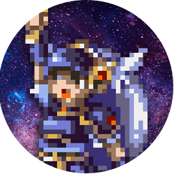

# Lenneth – Discord Bot

 

_**A work-in-progress Discord bot.**_

**LennethBot** is my current chatbot project for Discord.

It's a work in progress, so come back later!

---

### Local Setup Guide

1. Create the file `.env` and fill it out.
2. Run `npm install`.
3. (Set up Firebase?)

---

*The name **Lenneth** refers to the bravest of the three Valkyrie sisters and the protagonist of Square's "Valkyrie Profile" (PS1, 1999).*